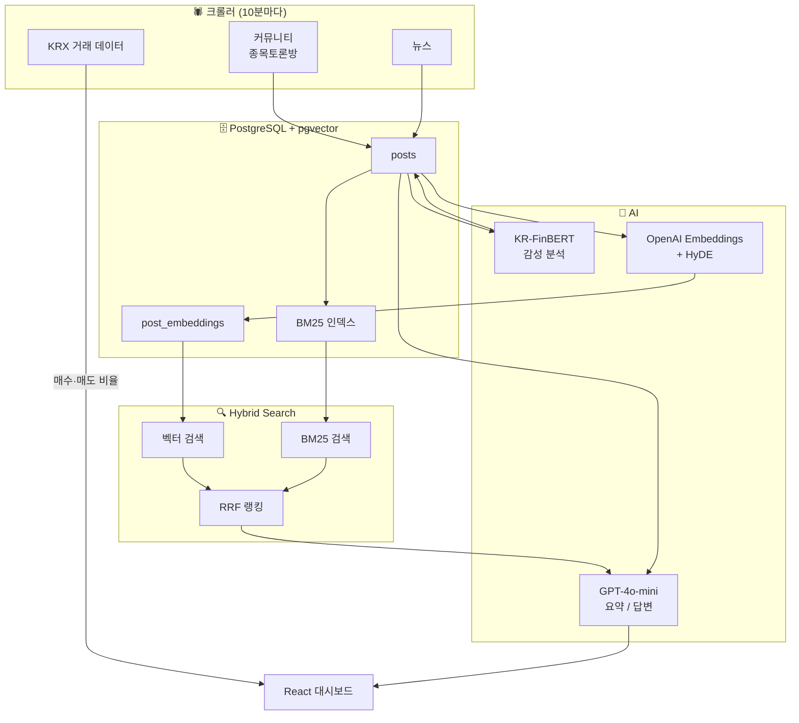

**주식 커뮤니티의 목소리를 감성으로 읽다**

Hearsay는 네이버 종토방과 뉴스의 게시글을 실시간으로 수집하고,
한국어 금융 특화 AI 모델로 감성을 분석해 투자 심리를 한눈에 파악할 수 있는 대시보드입니다.
숫자 너머의 시장 분위기를 텍스트에서 읽어내고,
궁금한 점은 AI에게 바로 질문할 수 있습니다.

**커뮤니티의 소문(hearsay)이 인사이트가 됩니다.**

 

# 목차

- 🌱 기획 배경
- ⛓ 주요 기능 흐름
  - 데이터 파이프라인
  - 기능 소개
    - 종목 대시보드
    - 오늘의 요약
    - 시간대별 여론 추이
    - 커뮤니티 Q&A
    - 게시글 피드
- ⚙️ 기술 스택 및 도입 이유
- 🧩 개발 과정
  - 왜 범용 모델이 아니라 파인튜닝했나?
    - 도메인 특화 데이터는 어떻게 만들었나?
    - 학습 데이터 불균형은 어떻게 다뤘나?
    - 파인튜닝 전후 성능은 얼마나 달라졌나?
  - RAG를 어떻게 설계했나?
    - 쿼리와 문서 사이의 분포 차이 문제
    - 키워드 검색과 벡터 검색, 무엇을 믿어야 할까?
- 💭 개인 회고

 

# 🌱 기획 배경

출퇴근하기 바쁜 와중에도 오늘 왜 올랐는지, 왜 떨어졌는지는 항상 궁금했습니다.  
그런데 막상 찾아보려면 뉴스, 커뮤니티, SNS를 따로따로 돌아다녀야 했고  
그렇게 모은 정보도 긍정 및 부정 의견이 뒤섞여 있어 결국 흐름을 파악하지 못한 채 포기하는 날이 더 많았습니다.

정보가 없는 게 아니라, 찾는 데 드는 시간과 수고가 너무 컸던 것입니다.

Hearsay는 그 불편함에서 시작됐습니다.

- 뉴스와 커뮤니티 게시글을 자동으로 수집하고
- 한국어 금융 특화 감성 분석 모델로 여론의 온도를 수치화하고
- "요즘 삼성전자 분위기 어때?" 같은 자연어 질문 하나로 바로 답을 얻을 수 있도록

정보를 모으는 시간을 줄이고, 판단에 더 집중할 수 있는 환경을 만드는 것이 목표입니다.

 

# ⛓ 주요 기능 흐름

## 데이터 파이프라인

