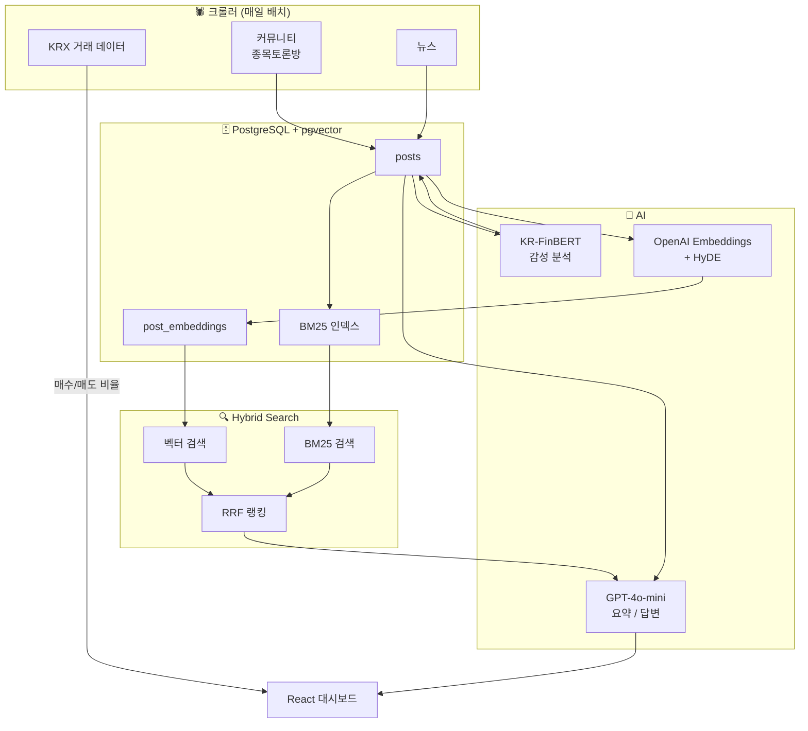

<div align="center">


**주식 커뮤니티의 목소리를 감성으로 읽다**

Hearsay는 네이버 종토방과 뉴스의 게시글을 매일 자동으로 수집하고, <br>
한국어 금융 특화 AI 모델로 감성을 분석해 투자 심리를 한눈에 파악할 수 있는 대시보드입니다. <br>
숫자 너머의 시장 분위기를 텍스트에서 읽어내고
궁금한 점은 AI에게 바로 질문할 수 있습니다.

**커뮤니티의 소문(hearsay)이 인사이트가 됩니다.**


</div>
<br>

# 목차

- [🌱 기획 배경](#-기획-배경)
- [⛓ 주요 기능 흐름](#-주요-기능-흐름)
  - [데이터 파이프라인](#데이터-파이프라인)
  - [기능 소개](#기능-소개)
    - [종목 대시보드](#-종목-대시보드)
    - [오늘의 요약](#-오늘의-요약)
    - [시간대별 여론 추이](#-시간대별-여론-추이)
    - [커뮤니티 Q&A](#-커뮤니티-qa)
    - [게시글 피드](#-게시글-피드)
- [⚙️ 기술 스택 및 도입 이유](#️-기술-스택-및-도입-이유)
- [🧩 개발 과정](#-개발-과정)
  - [감성 분석 모델 고도화: 키워드 매칭에서 파인튜닝까지](#감성-분석-모델-고도화-키워드-매칭에서-파인튜닝까지)
    - [왜 키워드 방식으로는 안 됐나?](#1-왜-키워드-방식으로는-안-됐나)
    - [왜 범용 모델이 아니라 파인튜닝했나?](#2-왜-범용-모델이-아니라-파인튜닝했나)
  - [검색 정확도 개선: 단일 검색기에서 하이브리드 검색까지](#검색-정확도-개선-단일-검색기에서-하이브리드-검색까지)
    - [왜 벡터 검색만으로는 부족했나?](#1-왜-벡터-검색만으로는-부족했나)
    - [서로 다른 두 검색기를 어떻게 하나의 순위로 합쳤나? (RRF)](#2-서로-다른-두-검색기를-어떻게-하나의-순위로-합쳤나-rrf)
    - [짧은 질문과 긴 게시글 제목 사이의 간극을 어떻게 좁혔나? (HyDE)](#3-짧은-질문과-긴-게시글-제목-사이의-간극을-어떻게-좁혔나-hyde)
- [🛣️ 개발 일정](#️-개발-일정)

<br>

# 🌱 기획 배경

출퇴근하기 바쁜 와중에도 오늘 왜 올랐는지, 왜 떨어졌는지는 항상 궁금했습니다. <br/>
그런데 막상 찾아보려면 뉴스, 커뮤니티, SNS를 따로따로 돌아다녀야 했고 <br/>
그렇게 모은 정보도 긍정 및 부정 의견이 뒤섞여 있어 결국 흐름을 파악하지 못한 채 포기하는 날이 더 많았습니다.

정보가 없는 게 아니라 찾는 데 드는 시간과 수고가 너무 컸던 것입니다.

Hearsay는 그 불편함에서 시작됐습니다.

- 뉴스와 커뮤니티 게시글을 자동으로 수집하고
- 한국어 금융 특화 감성 분석 모델로 여론의 온도를 수치화하고
- "요즘 삼성전자 분위기 어때?" 같은 자연어 질문 하나로 바로 답을 얻을 수 있도록

정보를 모으는 시간을 줄이고, 판단에 더 집중할 수 있는 환경을 만드는 것이 목표입니다.

<br>

# ⛓ 주요 기능 흐름

## 데이터 파이프라인


```mermaid
flowchart TD
    subgraph Crawler["🕷 크롤러 (매일 배치)"]
        C1[커뮤니티\n종목토론방]
        C2[뉴스]
        C3[KRX 거래 데이터]
    end

    subgraph DB["🗄 PostgreSQL + pgvector"]
        D1[posts]
        D2[post_embeddings]
        D3[BM25 인덱스]
    end

    subgraph AI["🤖 AI"]
        A1[KR-FinBERT\n감성 분석]
        A2[OpenAI Embeddings\n+ HyDE]
        A3[GPT-4o-mini\n요약 / 답변]
    end

    C1 & C2 --> D1
    C3 --> |매수/매도 비율| FE
    D1 --> A1 --> D1
    D1 --> A2 --> D2
    D1 --> D3

    subgraph Search["🔍 Hybrid Search"]
        S1[벡터 검색]
        S2[BM25 검색]
        S3[RRF 랭킹]
    end

    D2 --> S1 --> S3
    D3 --> S2 --> S3
    S3 --> A3

    D1 --> A3
    A3 --> FE[React 대시보드]
```

## 기능 소개

Hearsay는 아래와 같이 하나의 대시보드에서 종목별 수급, 여론, 커뮤니티 반응을 확인할 수 있습니다. 화면의 각 번호는 아래 기능 설명과 대응됩니다.

### 📷 전체 화면


### ① 종목 대시보드

- 개인, 기관, 외국인 세 그룹의 순매수 여부를 실거래 금액 기준으로 판단한 뒤 순매수 우세 그룹의 비율을 매수/매도 비율로 표시합니다. 장 마감 후 데이터가 없을 경우 커뮤니티 감성 분석 결과로 자동 대체됩니다.
- 수급 / 여론 / 오늘 언급량 / 핫 키워드 4종 통계 카드로 종목 현황을 한눈에 파악할 수 있습니다.

### ② 오늘의 요약

- 당일 게시글 제목 최대 40개를 GPT-4o-mini에 전달해 **호재 / 악재 / 이슈** 3가지 태그로 자동 분류 및 요약합니다.
- 매일 새벽 배치 수집이 끝나면 자동 갱신되며 당일 게시글이 없는 경우 섹션 자체가 노출되지 않습니다.

### ③ 시간대별 여론 추이

- KR-FinBERT가 분석한 게시글별 감성 점수를 시간대 단위로 집계합니다. 조회수가 높은 게시글에 가중치를 부여해 단순 평균보다 실제 여론에 가까운 수치를 반영합니다.
- 0 기준선 위는 긍정, 아래는 부정 여론이며 특정 시간대에 마우스를 올리면 점수를 확인할 수 있습니다.

### ④ 커뮤니티 Q&A

- "오늘 왜 올랐어?", "지금 분위기 어때?" 같은 자연어 질문에 커뮤니티, 뉴스 기반 답변을 반환합니다.
- 쿼리를 HyDE로 가상 문서화한 뒤 BM25 + 벡터 검색 결과를 RRF로 통합해 검색 품질을 높입니다. 뉴스 기반 팩트와 커뮤니티 여론을 구분해 답변합니다.
- 종목을 전환하면 이전 대화가 초기화되어 항상 선택된 종목 기준의 맥락으로 질문할 수 있습니다.

### ⑤ 게시글 피드

- 선택한 종목의 최신 커뮤니티, 뉴스 게시글을 우측 피드에서 확인할 수 있습니다.
- 각 게시글에는 KR-FinBERT가 분석한 감성 점수가 함께 표시됩니다.

<br>

# ⚙️ 기술 스택 및 도입 이유

### AI

| 기술                                                                                                                                                                                                                                    | 도입 이유                                                                                                                                           |
| ------------------------------------------------------------------------------------------------------------------------------------------------------------------------------------------------------------------------------------- | ----------------------------------------------------------------------------------------------------------------------------------------------- |
|   | 대상 텍스트가 한국어, 금융 도메인, 커뮤니티 은어 중심이라 범용 감성 모델의 정확도가 낮았습니다. 금융 텍스트로 사전학습된 모델을 직접 라벨링한 데이터로 파인튜닝해 도메인에 맞는 감성 분석 성능을 확보합니다.                           |
|                  | 벡터 검색만으로는 종목명, 티커, 수치처럼 정확히 일치해야 하는 키워드를 놓칠 수 있습니다. BM25와 함께 검색한 뒤 Reciprocal Rank Fusion(RRF)으로 결합해, 점수 정규화 없이 순위만으로 두 검색기를 통합하고 검색 안정성을 높입니다. |
|                                                                                                                                                                  | "요즘 분위기 어때?"처럼 추상적인 질문은 게시글과 임베딩 분포가 달라 검색 성능이 떨어질 수 있습니다. 질문 대신 LLM이 생성한 가상의 관련 문서를 임베딩해 검색 정확도를 높입니다.                                         |
|                                                                                                                               | 임베딩과 답변 생성 모델을 목적에 맞게 분리해 사용합니다. 임베딩은 한국어 성능 대비 비용 효율이 높은 소형 모델을, 답변 생성은 품질 대비 비용이 적절한 모델을 선택하며 임베딩은 배치 호출로 API 요청 수를 줄입니다.                    |

### Frontend

| 기술                                                                                                                                                                                                                            | 도입 이유                                                                                                     |
| ----------------------------------------------------------------------------------------------------------------------------------------------------------------------------------------------------------------------------- | --------------------------------------------------------------------------------------------------------- |
|   | 종목 선택 하나로 피드, 차트, 요약, 질의응답이 함께 갱신되는 화면이라 선언적 UI가 적합합니다. API 응답을 타입으로 관리해 백엔드 스키마 변경을 컴파일 단계에서 확인합니다.      |
|                                                                                                   | 대부분의 상태가 서버 데이터이며 5분 주기로 갱신됩니다. 캐싱, 중복 요청 제거, 로딩 및 에러 처리를 TanStack Query로 관리해 별도의 전역 상태 관리 라이브러리 없이 구현합니다. |
|                                                                                                                             | 빠른 HMR로 개발 생산성을 높이고, `server.proxy`를 통해 `/api` 요청을 FastAPI로 전달해 CORS 설정 없이 개발 환경을 구성합니다.                  |
|                                                                                                   | 대시보드 레이아웃을 컴포넌트 단위에서 빠르게 구성하고 수정하기 위해 사용합니다. 감성 색상은 CSS 변수로 관리해 일관된 디자인을 유지합니다.                           |


### Backend

| 기술                                                                                                                                                                                                 | 도입 이유                                                                                      |
| -------------------------------------------------------------------------------------------------------------------------------------------------------------------------------------------------- | ------------------------------------------------------------------------------------------ |
|                                                                                         | 타입 힌트를 기반으로 OpenAPI 문서를 자동 생성해 프론트엔드와 API 계약을 일관되게 유지합니다.                                  |
|   | 게시글 메타데이터와 임베딩을 하나의 데이터베이스에서 관리합니다. 별도 벡터 DB 없이 조건 필터링과 벡터 검색을 하나의 쿼리로 처리해 구조를 단순화합니다.     |
|                                                                                                                 | 크롤링 작업을 애플리케이션 내부에서 주기적으로 실행합니다. 현재 규모에서는 별도 워커와 메시지 브로커 없이도 단순한 구조로 운영할 수 있습니다.           |
|                              | 대상 사이트가 서버 사이드 렌더링이라 헤드리스 브라우저 없이 수집합니다. 상세 페이지는 스레드 풀로 병렬 요청하고 요청 간 지연을 적용해 서버 부하를 조절합니다. |

<br>

# 🧩 개발 과정

## 감성 분석 모델 고도화: 키워드 매칭에서 파인튜닝까지

## 1. 왜 키워드 방식으로는 안 됐나?

Hearsay의 핵심 기능은 종목별 **매수/매도 여론 비율**입니다. <br>
이 값이 틀리면 서비스가 제공하는 모든 판단이 틀리기 때문에 감성 분석의 정확도가 곧 제품의 신뢰도입니다.

초기 구현은 긍정과 부정 키워드 리스트를 하드코딩하고 <br>
제목에 포함된 단어 개수를 세는 방식이었습니다.

구현이 단순하고 비용이 거의 들지 않는다는 장점이 있었지만, <br>
실사용 데이터에서는 **문맥을 이해하지 못한다**는 한계가 드러났습니다.

### 1-1. "문맥을 못 읽는다"는 게 무슨 뜻인가

#### 목적

게시글 제목에서 투자 감성을 추출해 $-1.0$(강한 부정) ~ $1.0$(강한 긍정) 사이의 점수로 변환하는 것이 목표였습니다.

#### 기술적 접근 방식

제목에 등장한 긍정 키워드 수와 부정 키워드 수를 세고 그 비율로 점수를 계산했습니다.

$$
score = \frac{n_{pos} - n_{neg}}{n_{pos} + n_{neg}}
$$

- $n_{pos}$ : 제목에 포함된 긍정 키워드 개수
- $n_{neg}$ : 제목에 포함된 부정 키워드 개수

```python
POSITIVE_KEYWORDS = ["상승", "급등", "매수", "반등", "호재", "가즈아", ...]
NEGATIVE_KEYWORDS = ["하락", "급락", "매도", "손절", "악재", "물렸", ...]

def compute_sentiment(title: str) -> float:
    pos = sum(1 for kw in POSITIVE_KEYWORDS if kw in title)
    neg = sum(1 for kw in NEGATIVE_KEYWORDS if kw in title)
    total = pos + neg
    if total == 0:
        return 0.0
    return round((pos - neg) / total, 2)
```
> 키워드가 하나도 없으면 분모가 0이 되므로,
> 감성 점수는 항상 중립(0.0)으로 처리됩니다.

<br>

#### 📉 실사용 데이터에서 드러난 한계

| 게시글 제목         | 실제 의미         | 감지된 키워드 | 판정   |
| -------------- | ------------- | ------- | ---- |
| "매도하지마 지금 존버해" | 긍정 (매수 유지 권유) | `매도`    | ✕ 부정 |
| "물타기 성공 ㅠㅠ"    | 긍정에 가까움       | `물타기`   | ✕ 부정 |
| "앤티들아"         | 부정 (안티 지칭)    | 없음      | ✕ 중립 |

핵심 문제는 세 가지였습니다.

**① 부정어를 처리할 수 없습니다.** <br>
"매도"라는 단어가 있을 때 그것이 "매도하라"인지 "매도하지 마라"인지 구분할 방법이 없습니다. <br>
키워드 방식은 단어의 **존재 여부**만 보기 때문에 그 단어를 뒤집는 주변 표현을 볼 수 없습니다.

<br>

**② 사실상 3개 값밖에 나오지 않습니다.** <br>
수식은 연속적인 값을 계산하지만
짧은 제목에서는 대부분 한쪽 키워드만 등장합니다.

결과적으로 실제 출력은 -1, 0, 1 세 값에 집중되었습니다.

$$
n_{pos}=1,\ n_{neg}=0 \Rightarrow score = 1.0 \qquad
n_{pos}=0,\ n_{neg}=1 \Rightarrow score = -1.0
$$

⮕ 살짝 긍정과 확신에 찬 긍정이 똑같이 $1.0$이 됩니다. <br>
여론 **비율**을 계산하는 서비스에서 강도 구분이 사라지면 소수의 극단적인 글이 전체 지표를 흔듭니다.

<br>

**③ 커뮤니티 표현을 사람이 따라가야 합니다.** <br>
"ㄱㄱ", "가즈아", "존버", "앤티" 같은 표현은 계속 새로 생깁니다. <br>
그때마다 리스트를 수동으로 갱신해야 했고 <br>
반영되기 전까지는 해당 게시글이 모두 중립(0.0)으로 분류되었습니다.

<br>

> [!IMPORTANT]
>
> **문제는 키워드의 개수가 아니라 <판단 단위>였습니다.**
>
> 키워드 방식은 **단어**를 기준으로 판단합니다. <br>
> 하지만 감성은 **문장 전체의 문맥**에서 결정됩니다.
>
> 따라서 키워드 리스트를 계속 늘리는 대신, **문장 자체를 이해하는 모델**이 필요했습니다.

<br>

### 1-2. 그래서 어떤 모델을 골랐나

#### 목적

문장 전체를 문맥으로 이해하는 모델이 필요하다는 것은 분명했습니다. <br>
다만 모델 선택은 **정확도만의 문제가 아니라, 운영 구조와 함께 판단해야 하는 문제**였습니다.

Hearsay가 모델에 요구한 조건은 다음 세 가지였습니다.

| 조건 | 이유 |
| --- | --- |
| 문맥 이해 | 1-1에서 확인한 부정어/강도 문제 해결 |
| 상시 추론 가능 | 10분 주기 크롤링으로 추론이 지속적으로 발생 |
| 한국어 + 금융 도메인 | 종목, 수급, 실적 관련 표현이 대부분 |

이 중 **상시 추론 가능 여부**가 모델 선택을 결정했습니다.

#### 기술적 접근 방식

후보 모델을 다음 기준으로 비교했습니다.

| 방법 | 문맥 이해 | 추론 비용 | 한국어 금융 | 비고 |
| --- | --- | --- | --- | --- |
| 키워드 카운팅 (기존) | 낮음 | 없음 | - | 문맥 처리 불가 |
| GPT API | 높음 | 건당 과금 | 높음 | 운영 비용 증가 |
| KoELECTRA (범용) | 중간 | 무료 | 보통 | 금융 특화 아님 |
| **KR-FinBert-SC** | 높음 | 무료 | 높음 | 금융 사전학습, 로컬 추론 |

#### 운영 비용을 고려한 모델 선택

정확도만 보면 GPT API가 가장 좋은 선택입니다. 하지만 Hearsay에서는 **비용이 한 번 발생하고 끝나는 구조가 아니었습니다.**

```python
# .github/workflows/crawl.yml — 매일 새벽 배치가 무기한 반복된다
schedule:
  - cron: "0 18 * * *"   # UTC 18:00 = KST 03:00
```

크롤링 주기가 10분이므로 **하루 144회**, 매 사이클마다 5개 종목의 신규 게시글이 유입됩니다. <br>
즉 추론 대상은 고정된 데이터셋이 아니라 **시간에 따라 계속 증가하는 스트림**입니다.

| 구분 | 1회성 작업 | Hearsay의 감성 분석 |
| --- | --- | --- |
| 처리 대상 | 정해진 N건 | 지속적으로 유입되는 스트림 |
| 비용 성격 | 총비용 확정 | 운영 기간에 비례해 누적 |
| 종료 시점 | 있음 | 없음 |

건당 과금 방식은 **종료 시점이 없는 작업**에 적용되는 순간 비용을 예측하기 어려워집니다. <br>
서비스를 오래 운영할수록 분석 대상 종목이 늘어날수록 비용도 선형적으로 증가합니다.

반면 로컬 모델은 **한 번 배포하면 추론 횟수와 무관하게 비용이 고정**됩니다. <br>
따라서 먼저 **로컬 추론이 가능한 모델**을 후보로 제한한 뒤 그 안에서 가장 높은 정확도를 기대할 수 있는 모델을 선택했습니다.

> [!NOTE]
>
> **GPT는 사용하지 않았나요?**
>
> 사용했습니다. 다만 **역할이 다릅니다.**
>
> GPT는 상시 추론이 아니라 **한 번만 수행하면 되는 작업**, 즉 학습 데이터 라벨링에 활용했습니다. <br>
> 종료 시점이 있는 작업이므로 총비용을 예측할 수 있기 때문입니다.

#### 왜 KR-FinBert-SC였나

`snunlp/KR-FinBert-SC`는 **금융 텍스트로 사전학습된 한국어 BERT**입니다. <br>
로컬 추론이 가능해 운영 비용 조건을 만족하면서도 범용 한국어 모델(KoELECTRA 등)보다 "수급", "물량", "실적 컨센서스"와 같은 금융 도메인 표현을 더 잘 처리할 것으로 판단했습니다.

#### 도입하면서 정한 설계

**① 확률 3개를 하나의 연속 점수로 변환**

모델은 `positive` / `neutral` / `negative` 세 라벨의 확률을 반환합니다. 이를 다음과 같이 하나의 점수로 변환했습니다.

$$
score =
\begin{cases}
0.0 & \text{if } P(neutral) \geq 0.5 \\[6pt]
P(positive) - P(negative) & \text{otherwise}
\end{cases}
$$

```python
def _score_from_probs(probs: dict[str, float]) -> float:
    if probs.get("neutral", 0.0) >= settings.sentiment_neutral_dominance:
        return 0.0
    return round(probs.get("positive", 0.0) - probs.get("negative", 0.0), 3)
```

확률의 차이를 사용하기 때문에 결과는 **-1.0 ~ 1.0** 사이의 연속적인 점수가 됩니다. <br>
이를 통해 1-1에서 언급한 3개의 확률값만 존재하는 문제를 해결했습니다.

또한 `P(neutral)`이 0.5 이상이면 점수를 0으로 고정했습니다. <br>
모델이 중립이라고 판단한 글에서 미세한 확률 차이까지 점수에 반영되면 의미 없는 값이 누적될 수 있기 때문입니다.

<br>

**② 모델은 프로세스당 한 번만 로드**

모델 크기가 약 400MB이므로 요청마다 로드할 수 없습니다. <br>
싱글톤으로 한 번만 생성하고 서버 시작 시점(`lifespan`)에 미리 로드해 첫 번째 크롤링이 모델 초기화를 기다리지 않도록 했습니다.

<br>

**③ 배치 추론과 중복 연산 방지**

신규 게시글을 32건씩 배치로 추론하고 대상은 `sentiment_score`가 `NULL`인 게시글로 한정했습니다. <br>
이미 분석이 끝난 게시글은 다시 추론하지 않으므로 크롤링이 반복되더라도 추론량은 **신규 유입 게시글 수에만 비례**합니다.


> [!IMPORTANT]
>
> **하지만 한계도 있었습니다.**
>
> KR-FinBert-SC는 금융 **뉴스 기사**를 중심으로 학습된 모델입니다.
>
> 따라서 "3분기 영업이익이 컨센서스를 상회했다"와 같은 뉴스체 문장은 잘 처리하지만, <br>
> "앤티들아", "존버 가즈아"처럼 종목 토론방에서 사용하는 커뮤니티 문체는 학습 분포 밖에 있습니다.
>
> 즉 **금융 도메인에는 적합했지만 커뮤니티 문체에는 적합하지 않았습니다.**
>
> 이 한계를 해결하기 위해 다음 단계에서는 실제 종목 토론방 데이터를 활용한 파인튜닝을 진행했습니다.

<br>

## 2. 왜 범용 모델이 아니라 파인튜닝했나?

1-2에서 확인했듯 KR-FinBert-SC는 금융 **뉴스 기사**를 중심으로 학습된 모델입니다. <br>
"영업이익 컨센서스 상회" 같은 표현은 잘 이해하지만 "앤티들아" "존버 가즈아"처럼 종목 토론방에서 사용하는 문체는 학습 데이터에 거의 존재하지 않았습니다.

즉 금융이라는 **도메인**은 맞았지만 실제 서비스에서 다루는 **커뮤니티 문체**와는 차이가 있었습니다.

이 문제는 사전학습 모델만 교체해서는 해결되지 않습니다. <br>
결국 Hearsay가 실제로 수집하는 종목 토론방 데이터로 다시 학습시키는 과정이 필요했고 이를 위해 파인튜닝을 진행했습니다.

### 2-1. 도메인 특화 데이터는 어떻게 만들었나

#### 목적

파인튜닝을 하려면 라벨이 붙은 종목 토론방 데이터가 필요합니다. <br>
하지만 Hearsay에는 크롤링한 게시글만 있을 뿐 정답 라벨은 존재하지 않았습니다. 따라서 가장 먼저 해결해야 할 문제는 학습 데이터를 만드는 것이었습니다.

#### 기술적 접근 방식

수백 건의 게시글을 직접 라벨링하기에는 시간과 비용이 너무 컸습니다. <br>
대신 **GPT-4o-mini를 이용해 Silver Label을 생성하는 방식**을 선택했습니다. (`scripts/auto_label.py`)

```python
prompt = f"""당신은 한국 주식 커뮤니티(종토방) 게시글의 감성을 분류하는 전문가입니다.

아래 게시글들을 읽고 각각의 투자 감성을 판단하세요.

기준:
- positive: 주가 상승 기대, 호재, 매수 추천, 낙관적 전망
- negative: 주가 하락 우려, 악재, 매도 추천, 비관적 전망, 손실 언급
- neutral: 단순 정보 공유, 중립적 분석, 질문, 주식과 무관한 내용

반드시 아래 JSON 형식으로만 응답하세요:
{{"results": [{{"id": 1, "label": "positive"}}, ...]}}

게시글:
{items}"""
```

사람이 라벨링 기준을 정의하고 실제 판단은 GPT가 수행하도록 설계했습니다. <br>
이렇게 생성한 라벨을 파인튜닝에 사용할 **Silver Label**로 활용했습니다.

이 과정에서 세 가지를 고려했습니다.

**① 배치 20건 + JSON 모드**

게시글 20개를 한 번의 요청으로 묶어 전송했습니다. <br>
건별 호출보다 API 요청 횟수를 줄여 비용과 처리 시간을 함께 줄였고 <br>
`response_format={"type": "json_object"}`를 사용해 항상 JSON 형식으로 응답하도록 강제했습니다.

```python
response = client.chat.completions.create(
    model=settings.llm_model,
    max_tokens=500,
    response_format={"type": "json_object"},
    messages=[{"role": "user", "content": prompt}],
)
```

**② `post_id` 기준 중복 제거**

이미 라벨링한 게시글의 `post_id`를 CSV에서 읽어 제외하고 새로 생성한 결과는 append 방식으로 저장했습니다.

```python
def _load_labeled_ids() -> set[int]:
    if not OUTPUT_FILE.exists():
        return set()
    with OUTPUT_FILE.open(encoding="utf-8") as f:
        reader = csv.DictReader(f)
        return {int(row["post_id"]) for row in reader}
```

중간에 작업이 종료되더라도 다시 실행하면 이미 처리한 게시글은 건너뛰고 이어서 라벨링을 진행할 수 있습니다. <br>
목표 개수만 지정하면 원하는 만큼 데이터를 계속 누적할 수 있도록 설계했습니다.

**③ 라벨링에는 본문도 함께 사용**

GPT에는 제목뿐 아니라 본문 앞 150자도 함께 전달했습니다. <br>
제목만으로는 감성을 판단하기 어려운 게시글의 정확도를 높이기 위해서입니다.

```python
f'[{i+1}] 제목: {p["title"]} / 본문: {p["content"][:150]}'
```

이 과정을 통해 5개 종목에서 총 **604건의 Silver Label 데이터셋**을 구축했고 이를 기반으로 KR-FinBert-SC를 파인튜닝했습니다.

> [!NOTE]
>
> **1-2에서 세운 원칙은 그대로 유지했습니다.**
>
> 상시 추론은 로컬 모델이 담당하고 종료 시점이 있는 1회성 작업만 GPT를 사용한다는 원칙입니다.
>
> 라벨 생성은 604건을 만들면 끝나는 작업이므로 총비용을 예측할 수 있습니다.
>
> 결과적으로 GPT는 추론 모델이 아니라 **학습 데이터를 생성하는 도구**로 활용했고 생성한 데이터를 이용해 로컬 모델을 학습시키는 구조를 선택했습니다.

<br>

### 2-2. 학습 데이터 불균형은 어떻게 다뤘나

#### 목적

604건의 라벨 분포를 확인한 결과 클래스 간 개수 차이가 있었습니다. 이 차이가 학습에 그대로 반영되지 않도록 처리해야 했습니다.

| 라벨 | 개수 | 비율 |
| --- | --- | --- |
| neutral | 246 | 40.7% |
| negative | 212 | 35.1% |
| positive | 146 | 24.2% |

최다 클래스(neutral)와 최소 클래스(positive)의 비율은 약 **1.7 : 1**입니다.

#### 기술적 접근 방식

오버샘플링이나 class weight는 적용하지 않았습니다. 604건이라는 적은 데이터에서 소수 클래스를 복제하거나 가중치를 올리면 그 클래스의 몇 안 되는 샘플에 모델이 과적합될 위험이 더 크다고 판단했습니다. 1.7:1은 별도 보정이 필요할 만큼 극단적인 불균형도 아니었습니다.

대신 두 가지로 대응했습니다.

#### ① `stratify`를 사용해 검증셋의 대표성 확보

```python
train_texts, val_texts, train_labels, val_labels = train_test_split(
    texts, labels,
    test_size=0.2,
    random_state=42,
    stratify=labels,
)
```

`stratify` 없이 무작위로 분할하면 121건 규모의 검증셋에서 특정 클래스가 우연히 많이 포함되거나 거의 제외될 수 있습니다. <br>
`stratify=labels`를 적용해 Train과 Validation 모두 원본 데이터의 클래스 비율을 유지하도록 했고, 이를 통해 검증 결과의 신뢰성을 높였습니다.

#### ② 모델 선택 기준을 Accuracy 대신 `f1_macro`로 설정

```python
training_args = TrainingArguments(
    ...
    load_best_model_at_end=True,
    metric_for_best_model="f1_macro",
)
```
accuracy는 다수 클래스만 잘 맞혀도 높게 나옵니다. <br>
f1_macro는 클래스별 F1 점수를 동일한 가중치로 평균 내기 때문에 positive처럼 개수가 적은 클래스를 못 맞히면 점수가 함께 떨어집니다. <br>
데이터를 조작하는 대신 평가 기준 자체를 불균형에 둔감하지 않게 만드는 방향을 택했습니다.

> [!IMPORTANT]
>
> **이 선택이 실제로 결과를 바꿨습니다.**
>
> | epoch | accuracy | f1_macro |
> | --- | --- | --- |
> | 1 | 0.562 | 0.532 |
> | 2 | 0.603 | 0.555 |
> | 3 | 0.603 | **0.581** |
>
> epoch 2와 3의 accuracy는 0.603으로 완전히 동일합니다. accuracy만 기준으로 삼았다면 두 체크포인트 중 어느 쪽을 골라도 상관없었을 것입니다. <br>
> 하지만 f1_macro는 0.555 → 0.581로 올랐습니다. 소수 클래스에 대한 판별력이 실제로 개선됐다는 뜻이고 `metric_for_best_model="f1_macro"` 덕분에 이 차이를 놓치지 않고 epoch 3 체크포인트가 최종 선택됐습니다.

<br>

## 검색 정확도 개선: 단일 검색기에서 하이브리드 검색까지

## 1. 왜 벡터 검색만으로는 부족했나?

Hearsay의 질의응답 기능은 사용자의 자연어 질문을 종목 커뮤니티 게시글과 매칭해 근거가 되는 글을 찾은 뒤 그 위에서 답을 생성합니다. <br>
답의 품질은 결국 "질문과 가장 관련 있는 글을 얼마나 잘 찾아오는가"에 달려 있습니다. 처음에는 벡터 검색 하나로 이 문제를 풀려고 했습니다.

### 1-1. 벡터 검색은 무엇을 하는가

#### 목적

사용자의 질문과 **의미가 비슷한** 게시글을 찾는 것이 목표였습니다. <br>
단어가 정확히 겹치지 않아도 "요즘 분위기 어때?"라는 질문이 "다들 낙관적이네요"라는 글과 의미적으로 연결되기를 기대했습니다.

#### 기술적 접근 방식

질문과 게시글을 각각 벡터로 임베딩한 뒤 벡터 간 거리가 가까운 순서로 정렬합니다.

```python
query_vector = get_embedding(search_text)   # OpenAI text-embedding-3-small

result = db.execute(text("""
    SELECT p.id, p.title, ...,
           pe.embedding <=> CAST(:query_vector AS vector) AS distance
    FROM post_embeddings pe
    JOIN posts p ON pe.post_id = p.id
    WHERE p.stock_code = :stock_code
    ORDER BY distance ASC
    LIMIT :top_k
"""), params)
```

`<=>`는 pgvector의 코사인 거리 연산자입니다. <br>
거리가 작을수록(0에 가까울수록) 의미적으로 가깝다는 뜻이고 이 값 기준으로 오름차순 정렬해 상위 `k`개를 후보로 뽑습니다.

<br>

### 1-2. 그런데 왜 정확히 일치해야 하는 검색어를 놓치는가

#### 문제

임베딩 모델은 문장의 **전반적인 의미**를 하나의 벡터로 압축합니다. <br>
이 과정에서 종목명, 가격, 날짜처럼 **정확히 일치해야만 의미가 있는 토큰**은 오히려 손해를 봅니다. <br>
모델 입장에서는 "9만원"과 "10만원"이 둘 다 가격을 언급하는 문장이라는 점에서 비슷하게 처리될 수 있고, <br>
정작 사용자가 찾는 건 "9만원"이라는 정확한 숫자가 들어간 글 한 편이기 때문입니다.

**예시:**

> | 질문 | 삼성전자 게시글 중 | 벡터 검색 결과 |
> | --- | --- | --- |
> | "9만원 간다는 글 있었나?" | "삼성전자 9만 간다 가즈아" | 순위 밖으로 밀림 (의미상 비슷한 "10만 간다" 류 글과 뒤섞임) |
> | "오늘 외국인 수급 어때" | "오늘 외국인 순매수 전환" | 상위권 (의미가 실제로 비슷해서 잘 잡힘) |

⮕ 의미가 실제로 비슷한 질문에는 벡터 검색이 잘 작동합니다. 문제는 **의미보다 정확한 일치가 중요한 질문**에서 발생합니다.

이 직관은 실제 평가에서도 확인됩니다. <br>
같은 평가셋(14개 질의)에 대해 벡터 검색 단독의 Hit@1은 64.3%로, 키워드 기반 검색(BM25) 단독의 85.7%보다 낮았습니다. <br>
두 검색기가 서로 다른 종류의 질문에서 강점을 보인다는 뜻입니다.

> [!IMPORTANT]
>
> _**결국 의미와 정확한 일치는 서로 다른 문제입니다**_
>
> 벡터 검색은 의미가 비슷한 문장을 잘 찾지만 종목명/티커/숫자처럼 이산적인 토큰의 정확한 일치는 놓치기 쉽습니다. <br>
> 반대로 키워드 기반 검색(BM25)은 정확한 일치는 잘 잡지만 "분위기가 어때?" 같은 추상적인 질문에는 약합니다.
>
> ⮕ 둘 중 하나를 선택하는 대신, 의미 기반 검색과 키워드 검색을 결합하는 하이브리드 검색 구조를 설계했습니다.

<br>

## 2. 서로 다른 두 검색기를 어떻게 하나의 순위로 합쳤나? (RRF)

### 2-1. 왜 점수를 그냥 더할 수 없었나

#### 목적

벡터 검색과 BM25 검색, 두 결과를 하나의 순위로 합쳐야 했습니다. <br>
가장 먼저 떠오르는 방법은 **각 검색기의 점수를 더한다**였지만 실제로는 그럴 수 없었습니다.

#### 문제
두 검색기가 반환하는 점수는 **단위도, 방향도, 범위도 다릅니다.**

| | 벡터 검색 | BM25 검색 |
| --- | --- | --- |
| 반환값 | 코사인 **거리** (`<=>`) | BM25 **점수** |
| 범위 | 대략 0 ~ 2 | 문서 길이·용어 빈도에 따라 상한 없음 |
| 방향 | **작을수록** 유사 | **클수록** 유사 |

방향부터 반대입니다. 벡터는 거리가 작을수록 좋고 BM25는 점수가 클수록 좋습니다. <br>
방향을 맞춰 더한다 해도 BM25 점수는 게시글 길이나 흔한 단어 여부에 따라 값이 크게 출렁이는 반면 벡터 거리는 0~2 사이로 안정적입니다. <br>
정규화 없이 단순히 더하면 스케일이 큰 쪽(BM25)이 결과를 사실상 독점합니다.

<br>

### 2-2. 점수 대신 "순위"로 합친다 — RRF

#### 기술적 접근 방식

**Reciprocal Rank Fusion**은 원본 점수를 아예 쓰지 않습니다. 대신 각 검색기 안에서 몇 번째 순위인지만 봅니다.

$$
RRF(d) = \sum_{\text{검색기}} \frac{1}{k + rank(d)}
$$

- $rank(d)$: 해당 검색기에서 문서 $d$가 몇 번째로 나왔는지 (1위, 2위, …)
- $k$: 순위 충격을 완화하는 상수 (Hearsay는 $k=60$ 사용)

```python
def _reciprocal_rank_fusion(vector_results, bm25_results, top_k):
    rrf_scores: dict[int, float] = {}
    k = settings.rrf_k  # 60

    for rank, post in enumerate(vector_results, start=1):
        pid = post["id"]
        rrf_scores[pid] = rrf_scores.get(pid, 0.0) + 1.0 / (k + rank)

    for rank, post in enumerate(bm25_results, start=1):
        pid = post["post_id"]
        rrf_scores[pid] = rrf_scores.get(pid, 0.0) + 1.0 / (k + rank)

    sorted_ids = sorted(rrf_scores, key=lambda pid: rrf_scores[pid], reverse=True)
    return [meta_map[pid] for pid in sorted_ids[:top_k]]
```

⮕ 점수의 크기는 완전히 버려지고, **몇 등이었는가**만 남습니다. <br>
두 검색기의 점수 스케일이 아무리 달라도 순위는 항상 1, 2, 3, … 이므로 비교 기준이 저절로 통일됩니다.

**예시:**

> | post_id | 벡터 순위 | BM25 순위 | RRF 점수 ($k=60$) |
> | --- | --- | --- | --- |
> | A | 1위 | 5위 | $\frac{1}{61} + \frac{1}{65} \approx 0.0318$ |
> | B | 3위 | 1위 | $\frac{1}{63} + \frac{1}{61} \approx 0.0323$ |
> | C | 없음 | 2위 | $\frac{1}{62} \approx 0.0161$ |

⮕ B는 두 검색기 모두에서 상위권에 들어 가장 높은 RRF 점수를 받습니다. C처럼 한쪽 검색기에만 잡힌 문서도 완전히 배제되지 않고 순위에 반영됩니다.

#### $k=60$은 왜 필요한가

$k$가 없으면($k=0$) 1위와 2위의 점수 차이($\frac{1}{1} - \frac{1}{2} = 0.5$)가 9위와 10위의 차이($\frac{1}{9} - \frac{1}{10} \approx 0.011$)보다 압도적으로 커집니다. <br>
상위 1~2개 결과가 전체 순위를 지배하게 되는 것입니다. <br>
$k$를 더하면 이 격차가 완만해져서, 두 검색기 사이에서 **골고루 상위권에 든 문서**가 한쪽에서만 1위인 문서보다 유리해지도록 조정됩니다.

> [!NOTE]
>
> _**한쪽 검색기가 실패해도 결과가 무너지지 않습니다**_
>
> 점수를 정규화해서 합치는 방식이었다면 한쪽 검색기가 이상한 값을 반환할 때 전체 결과가 같이 흔들릴 수 있습니다. <br>
> RRF는 순위만 쓰기 때문에 벡터 검색이 완전히 빗나가도 BM25 순위만으로 최소한의 결과는 유지됩니다. 반대의 경우도 마찬가지입니다.

<br>

## 3. 짧은 질문과 긴 게시글 제목 사이의 간극을 어떻게 좁혔나? (HyDE)

### 3-1. 질문과 문서는 애초에 다른 종류의 글이다
#### 문제
벡터 검색은 "질문 벡터"와 "게시글 벡터"의 거리를 잽니다. 그런데 이 둘은 애초에 **같은 종류의 글이 아닙니다.**

> | | 예시 |
> | --- | --- |
> | 사용자 질문 | "삼성전자 요즘 분위기 어때?" — 짧고, 추상적이고, 회화체 |
> | 실제 게시글 제목 | "삼성전자, 반도체 수요 회복 기대감에 커뮤니티 긍정 여론 증가" — 구체적이고, 정보를 압축한 문어체 |

같은 내용을 묻고 답하는 관계여도 질문 자체를 임베딩하면 회화체 짧은 문장의 벡터가 되고, 게시글은 정보 밀도가 높은 문어체 벡터가 됩니다. <br>
**분포 자체가 다른 두 종류의 텍스트를 직접 비교**하는 셈이라 의미가 통하는 글도 벡터 거리가 예상보다 멀게 나올 수 있습니다.

<br>

### 3-2. 질문 대신, "있을 법한 답변 제목"을 임베딩한다 — HyDE

#### 목적
질문을 그대로 임베딩하는 대신, 질문에 **답이 됐을 법한 게시글 제목을 먼저 만들고 그것을 임베딩**하면 비교 대상의 종류가 같아집니다. <br>
이 방식을 HyDE(Hypothetical Document Embeddings)라고 합니다.

#### 기술적 접근 방식

LLM에게 "이 질문에 답하는 실제 커뮤니티 글 제목을 한 줄로 써 달라"고 요청합니다.

```python
def _generate_hypothetical_document(query: str, stats: Stats | None = None) -> str:
    response = openai_client.chat.completions.create(
        model=settings.llm_model,
        max_tokens=80,
        temperature=0,
        messages=[
            {
                "role": "system",
                "content": (
                    "당신은 주식 커뮤니티 게시글 제목을 작성하는 봇입니다. "
                    "사용자 질문을 받으면, 그 질문에 대한 답이 담겼을 법한 "
                    "실제 커뮤니티 게시글 제목을 딱 한 줄만 출력하세요. "
                    "다른 말은 절대 하지 마세요."
                ),
            },
            {"role": "user", "content": query},
        ],
    )
    hypothetical = response.choices[0].message.content.strip()
    return hypothetical
```

**예시:**

> | 사용자 질문 | HyDE가 생성한 가상 문서 |
> | --- | --- |
> | "삼성전자 요즘 분위기 어때?" | "삼성전자, 반도체 수요 회복 기대감에 커뮤니티 긍정 여론 증가" |

⮕ 이제 임베딩되는 두 대상(가상 문서, 실제 게시글)이 **같은 문체/정보 밀도**를 가지므로 벡터 거리가 실제 의미 유사도를 더 잘 반영하게 됩니다. <br>
`temperature=0`으로 생성 결과의 변동을 최소화해 같은 질문에는 최대한 같은 가상 문서가 나오도록 했습니다.

<br>

### 3-3. LLM 호출이 실패할 수 있다는 전제

HyDE는 검색 전에 LLM 호출을 하나 더 넣는 방식입니다. API 실패, 타임아웃, 레이트 리밋 같은 상황이 검색 자체를 막아서는 안 됩니다.

```python
try:
    response = openai_client.chat.completions.create(...)
    hypothetical = response.choices[0].message.content.strip()
    return hypothetical
except Exception as e:
    print(f"[HyDE] 가상 문서 생성 실패, 원본 쿼리 사용: {e}")
    return query
```

⮕ 생성에 실패하면 원본 질문을 그대로 임베딩합니다. HyDE는 검색 품질을 **올리는** 장치이지, 없으면 검색이 안 되는 필수 단계가 아니어야 한다고 판단했습니다.

<br>

## 🛣️ 개발 일정
**프로젝트 기간: 2026. 06. 28 - 07. 17**

### 1주차 — 기획 및 데이터 파이프라인 구축
- PostgreSQL + pgvector 스키마 설계 및 초기 환경 세팅
- 네이버 종토방 크롤러 및 10분 주기 스케줄러 구현
- 키워드 기반 감성 분석 프로토타입 및 RAG 질의응답 초기 버전
- 프론트엔드 초기 세팅 및 대시보드 기본 UI 구현

### 2주차 — 감성 분석 고도화 및 하이브리드 검색 도입
- GPT 자동 라벨링 기반 KR-FinBert-SC 파인튜닝 적용
- BM25 + 벡터 하이브리드 검색(RRF) 도입
- 종목별 AI 데일리 요약, 종목 추가/삭제 기능 구현
- KRX 실거래 매수/매도 비율(수급) 데이터 연동
- HyDE 기반 벡터 검색 정확도 개선

### 3주차 — 질의응답 고도화 및 마무리
- 종목별 질문/답변 히스토리 기능 추가
- 주식 외 질문 거부 가드레일 등 답변 프롬프트 개선
- RAG 답변에 게시글 본문/감성 점수 반영
- UI 컴포넌트 정리 및 전체 흐름 마무리
